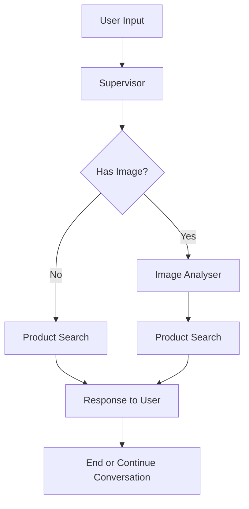

# Shopping Assistant - Multi-Agent LangGraph Application

## 🛍️ Project Overview

This is a sophisticated **Shopping Assistant** built using [LangGraph](https://github.com/langchain-ai/langgraph), a framework for building stateful, multi-agent conversational AI applications. The assistant helps users find products by analyzing images, gathering preferences through conversation, and searching through a product database using a streamlined multi-agent approach.

## 🏗️ Architecture

The application implements a **streamlined multi-agent orchestration pattern** with the following specialized agents:

### Core Agents

1. **Supervisor** (`supervisor.py`) - The orchestrator that routes between agents based on user input type
2. **Image Analyser** (`image_analyser.py`) - Processes product images to extract visual attributes
3. **Product Search** (`product_search.py`) - Handles conversational interaction and intelligent product searching

### Workflow



## 🚀 Prerequisites

- **Python >= 3.11** (Required for optimal performance and modern typing features)
- **LangSmith API Key** (Optional - free tieravailable)
- **OpenAI API Key** (For LLM functionality)
- **Git** (For cloning the repository)

## 📦 Installation & Setup

### 1. Clone and Navigate

```bash
git clone <repository-url>
cd shopping_assistant
```

### 2. Create Virtual Environment

```bash
# Using Python 3.13+
python3.13 -m venv venv

# Activate virtual environment
# On macOS/Linux:
source venv/bin/activate
# On Windows:
# venv\Scripts\activate
```

### 3. Install Dependencies

```bash
# Install the project in editable mode with CLI tools
pip install -e . "langgraph-cli[inmem]"

# Or install development dependencies
pip install -e ".[dev]"
```

### 4. Environment Configuration

Create a `.env` file from the example template:

```bash
cp .env.example .env
```

Edit `.env` with your API keys:

```env
# Required: LangSmith for tracing and observability
LANGSMITH_API_KEY=lsv2_your_langsmith_api_key_here

# Required: OpenAI for LLM functionality  
OPENAI_API_KEY=sk-your_openai_api_key_here

# Optional: Additional model providers
ANTHROPIC_API_KEY=sk-your_anthropic_key_here
```

**Getting API Keys:**
- **LangSmith**: Sign up at [smith.langchain.com](https://smith.langchain.com/) (free tier available)
- **OpenAI**: Get your key from [platform.openai.com](https://platform.openai.com/)

## 🏃‍♂️ Running the Application

### Local Development Server

Start the LangGraph development server:

```bash
langgraph dev
```

**Expected Output:**
```
Ready!
* API: http://localhost:2024
* Docs: http://localhost:2024/docs  
* LangGraph Studio Web UI: https://smith.langchain.com/studio/?baseUrl=http://127.0.0.1:2024
```

### Available Interfaces

1. **API Endpoint**: `http://localhost:2024` - REST API for programmatic access
2. **Interactive Docs**: `http://localhost:2024/docs` - Swagger/OpenAPI documentation
3. **LangGraph Studio**: Visual debugging interface (click the Studio link from console output)
4. **AgentChat Interface**: [https://agentchat.vercel.app/?apiUrl=http://localhost:2024&assistantId=agent](https://agentchat.vercel.app/?apiUrl=http://localhost:2024&assistantId=agent) - Direct chat interface to interact with your shopping assistant

### Development Features

- 🔄 **Hot Reload**: Code changes automatically refresh the server
- 🐛 **Visual Debugging**: Use LangGraph Studio to step through agent execution
- 📊 **Tracing**: All interactions are traced in LangSmith for analysis
- 🧩 **State Management**: Edit past states and rerun from specific points

## 🧠 How the Shopping Assistant Works

### State Management

The application maintains conversation state using a custom `State` class that extends `MessagesState`:

```python
class State(MessagesState):
    product_search_details: Optional[ProductSearchDetails] = None
    product_found: Optional[bool] = Field(default=False)
    next_node: str = "supervisor"
    image_registered: Optional[bool] = Field(default=False)
    current_question: Optional[str] = Field(default=None)
    remaining_steps: Optional[List[str]] = None
```

### Agent Coordination Flow

#### 1. **Supervisor Agent** - Traffic Controller
- **Purpose**: Routes user requests to appropriate specialized agents
- **Simplified Logic**:
  - Detects images → Routes to Image Analyser
  - Text input → Routes directly to Product Search
  - Uses `next_node` state for routing control

#### 2. **Image Analyser Agent** - Computer Vision
- **Purpose**: Extracts product attributes from uploaded images
- **Capabilities**:
  - Identifies product categories (clothing, electronics, furniture, etc.)
  - Extracts visible attributes (color, style, brand, material)
  - Determines confidence levels for analysis
  - Suggests additional research attributes
- **Output**: Structured `ProductSearchDetails` with confidence scores

#### 3. **Product Search Agent** - Conversational AI & Database Integration
- **Purpose**: Handles all conversational interaction and performs intelligent product searches
- **Enhanced Capabilities**:
  - **Conversational Intelligence**: Manages greetings, questions, and natural dialogue
  - **Information Gathering**: Extracts product preferences from user messages
  - **Strategic Questioning**: Asks targeted questions to gather missing details
  - **Database Search**: Performs intelligent product searches using collected criteria
- **Tools Available**:
  - `search_products`: Multi-criteria product search
  - `get_all_categories`: Browse available categories
  - `get_all_brands`: Explore brand options
  - `get_product_by_id`: Retrieve specific products
  - `get_products_by_category`: Category-based browsing
- **Intelligence**: Uses ReAct pattern for tool selection and execution

### Example User Journey

1. **User**: "Hi, I'm looking for headphones" 
   - **Product Search**: Welcomes user, extracts category="headphones", asks about budget

2. **User**: "Around $100-200"
   - **Product Search**: Extracts price="$100-200", asks about style preferences (over-ear, in-ear, wireless)

3. **User**: "Wireless would be great"
   - **Product Search**: Extracts style="wireless", searches database with criteria and returns matching products

4. **System**: Returns matching products with details and recommendations

### Advanced Features

#### Image-First Shopping
Users can upload product images to start their search:
- AI vision extracts visible attributes
- System automatically fills search criteria
- Product Search agent follows up with targeted questions for missing details

#### Conversational Intelligence
- Single agent handles all conversation aspects
- Maintains context across multiple exchanges
- Balances information gathering with product searching
- Natural dialogue flow with strategic questioning

#### Confidence-Based Routing
- Image analysis includes confidence scoring
- Low confidence triggers alternative flows
- Ensures reliable product identification

## 🛠️ Development & Customization

### Project Structure

```
src/
├── agent/                    # Core agent implementations
│   ├── supervisor.py        # Main orchestrator (simplified routing)
│   ├── image_analyser.py    # Computer vision agent
│   └── product_search.py    # Conversational AI + search agent
├── state.py                 # Application state definitions
├── core/                    # Configuration and settings
├── tools/                   # Database and external tools
├── utils/                   # Utility functions
└── data/                    # Data files and schemas
```

### Customization Points

1. **Add New Product Attributes**: Extend `ProductSearchDetails` in `state.py`
2. **Modify Conversation Flow**: Update prompts and logic in `product_search.py`
3. **Add Search Tools**: Extend the tools available to `product_search.py`
4. **Change Routing Logic**: Modify decision tree in `supervisor.py`

### Testing and Debugging

- **LangGraph Studio**: Visual workflow debugging with state inspection
- **LangSmith Tracing**: Complete execution trace with LLM call analysis
- **Hot Reload**: Immediate testing of code changes
- **State Editing**: Modify conversation state and rerun from any point

## 🚀 Deployment Options

### Local Development
```bash
langgraph dev  # Development server with hot reload
```

### Production Deployment

Refer to the [LangGraph Deployment Guide](https://langchain-ai.github.io/langgraph/agents/deployment/) for detailed instructions on:

- **Cloud Deployment**: Deploy to major cloud providers
- **Self-Hosted**: Run on your own infrastructure
- **Docker**: Containerized deployment options
- **Kubernetes**: Scalable orchestrated deployment

### Deployment Requirements
- LangSmith account (free tier available)
- Cloud provider or self-hosted environment
- Environment variables properly configured
- Database connectivity for product search

## 🔧 Configuration Options

The application supports various configuration options through environment variables and the `core/config.py` module:

- **Model Selection**: Choose between OpenAI, Anthropic, or other supported LLMs
- **Temperature Settings**: Adjust creativity vs consistency for different agents
- **Timeout Configuration**: Set appropriate timeouts for various operations
- **Logging Levels**: Configure detailed logging for debugging

## 📚 Additional Resources

- [LangGraph Documentation](https://langchain-ai.github.io/langgraph/)
- [LangGraph Studio Guide](https://langchain-ai.github.io/langgraph/concepts/langgraph_studio/)
- [LangSmith Tracing](https://smith.langchain.com/)
- [Multi-Agent Patterns](https://langchain-ai.github.io/langgraph/concepts/multi_agent/)

## 🤝 Contributing

1. Fork the repository
2. Create a feature branch (`git checkout -b feature/amazing-feature`)
3. Make your changes
4. Test using LangGraph Studio
5. Commit your changes (`git commit -m 'Add amazing feature'`)
6. Push to the branch (`git push origin feature/amazing-feature`)
7. Open a Pull Request

## 🆘 Troubleshooting

### Common Issues

1. **"Python version not supported"**: Ensure you're using Python 3.13+
2. **API key errors**: Verify your `.env` file has correct API keys
3. **Port already in use**: Kill existing processes on port 2024 or use `langgraph dev --port 2025`
4. **Import errors**: Ensure you installed with `pip install -e .`

### Getting Help

- Check the [LangGraph documentation](https://langchain-ai.github.io/langgraph/)
- Review traces in LangSmith for debugging
- Use LangGraph Studio for visual debugging
- Open an issue in the repository

---